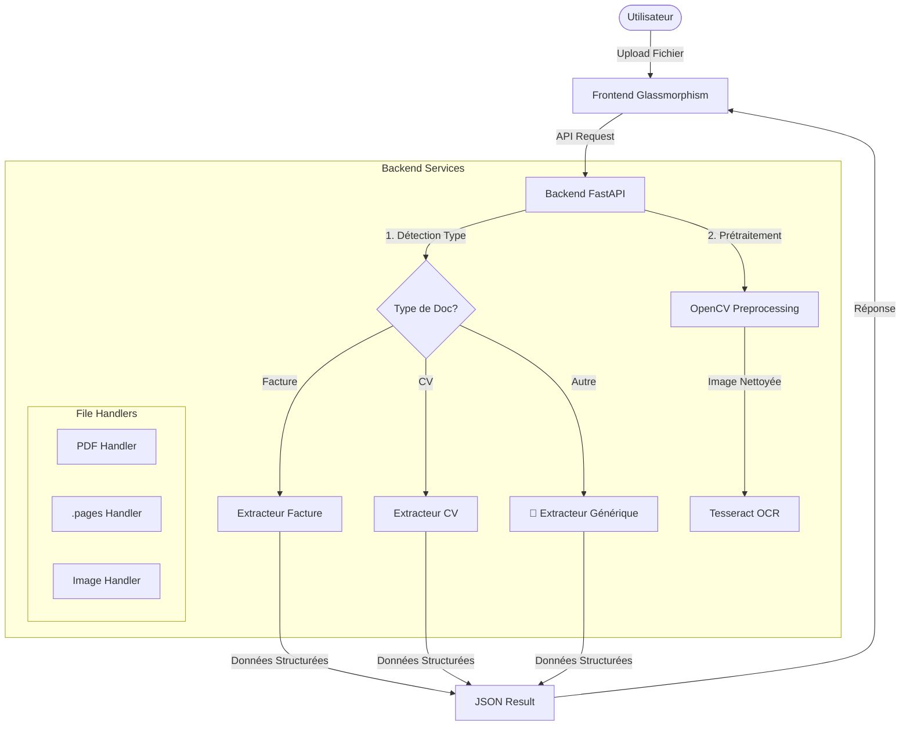
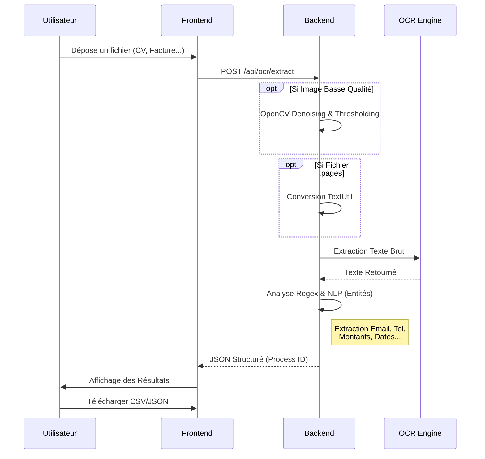

#  OCR Intelligent - Système d'Extraction Documentaire Avancé


Bienvenue dans le projet **OCR Intelligent**. Une solution moderne et puissante pour extraire intelligemment des données structurées à partir de divers documents (CV, Factures, Essais), même à partir d'images de basse qualité ou de fichiers `.pages`.

---


## Remerciement 

Nous adressons nos remerciements les plus sincères au **Pr. Dr. Hicham BENALLA** pour son encadrement et son soutien essentiel dans le cadre de notre projet de développement d'un OCR Intelligent.

Ses connaissances approfondies et ses retours constructifs nous ont été d'une aide inestimable. Nous sommes très reconnaissants pour le temps qu'il nous a consacré et pour la qualité de son accompagnement pédagogique.


## Architecture du Système

Voici comment le système est structuré, du Frontend au Backend :



---

##  Flux de Traitement

Le processus de traitement d'un document suit les étapes suivantes :



---

##  Fonctionnalités Clés

### 1.  Interface Utilisateur Moderne
- **Glassmorphism Design** : Une interface épurée et futuriste.
- **Feedback Temps Réel** : Animations de chargement et visualisation instantanée des données.
- **Export Facile** : Téléchargez vos données structurées en **JSON** ou **CSV**.

### 2.  Intelligence Backend
- **Prétraitement d'Image (OpenCV)** : Amélioration automatique des images floues ou bruitées pour un OCR optimal.
- **Reconnaissance de Type** : Détecte automatiquement si le document est un CV, une Facture, ou un devoir.
- **Extraction d'Entités** :
  - **CV** : Nom, Email, Téléphone, Compétences, Expérience.
  - **Factures** : Numéro, Date, Montant Total, TVA.

### 3.  Support Étendu
- Support natif des fichiers **Apple .pages**.
- Support des PDFs et images (JPG, PNG, TIFF).
- Support bilingue **Français 🇫🇷** et **Anglais 🇺🇸**.

---

##  Installation et Démarrage

### Prérequis
- Python 3.8+
- Tesseract OCR installé sur votre machine (`brew install tesseract` sur Mac)
- `textutil` (inclus nativement sur macOS pour le support .pages)

### 1. Installation du Backend
```bash
cd backend
pip install -r requirements.txt
```

### 2. Démarrage du Serveur
```bash
python3 run.py
```
Le serveur démarrera sur `http://localhost:8000`.

### 3. Utilisation
Ouvrez simplement le fichier `frontend/index.html` dans votre navigateur.
*Aucun serveur frontend complexe n'est nécessaire pour cette version, c'est du pur HTML/JS moderne.*

---

##  Orchestration avec Airflow (optionnel)

Le projet peut être orchestré avec **Apache Airflow** pour le traitement par lots planifié (ex. toutes les heures) : le DAG appelle l'API OCR pour traiter les documents déposés dans un dossier `inbox`.

- **Docker** : `docker-compose -f docker-compose.yml -f docker-compose.airflow.yml up -d`  
  → Airflow : http://localhost:8080 (admin / admin)
- **Documentation** : voir [AIRFLOW.md](AIRFLOW.md) pour la configuration et l'utilisation du DAG `ocr_batch_pipeline`.

---

##  Stack Technique

- **Backend** : FastAPI, Python, OpenCV, Pytesseract, TextUtil.
- **Frontend** : HTML5, Vanilla JS, TailwindCSS (CDN).
- **Design** : CSS Glassmorphism, FontAwesome, Google Fonts (Inter).

---

## Auteurs

**CHAHOUB NOUHAILA**  


Simulateur développé dans le cadre d'un projet académique d'émulation de microprocesseur.

"Développer pour comprendre, apprendre pour avancer"


##  Licence
Ce projet est sous licence MIT.
