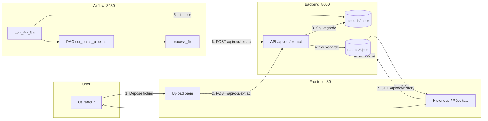

# Schéma du flux de données - OCR Intelligent

## Vue d’ensemble

```
┌─────────────────────────────────────────────────────────────────────────────────┐
│                              UTILISATEUR                                         │
│                    (navigateur : localhost ou IP)                                 │
└─────────────────────────────────────────────────────────────────────────────────┘
                    │                                    │
                    │ Upload fichier                     │ Consulter historique
                    │ (upload.html)                      │ (history.html, results.html)
                    ▼                                    ▼
┌─────────────────────────────────────────────────────────────────────────────────┐
│                              FRONTEND (port 80)                                  │
│  • Affiche les pages (upload, login, historique, résultats)                      │
│  • Envoie les requêtes API (token JWT dans le header)                             │
└─────────────────────────────────────────────────────────────────────────────────┘
                    │                                    ▲
                    │ POST /api/ocr/extract              │ GET /api/ocr/history
                    │ (fichier + token)                  │ GET /api/ocr/results/{id}
                    ▼                                    │
┌─────────────────────────────────────────────────────────────────────────────────┐
│                              BACKEND (port 8000)                                 │
│  • Reçoit le fichier → OCR → sauvegarde résultats                                │
│  • Lit/écrit : uploads/inbox/  et  results/*.json                                │
└─────────────────────────────────────────────────────────────────────────────────┘
                    │                                    ▲
                    │ Fichier enregistré                 │ DAG appelle la même API
                    │ dans uploads/inbox/                │ (POST /api/ocr/extract)
                    ▼                                    │
┌─────────────────────────────────────────────────────────────────────────────────┐
│  backend/uploads/inbox/          backend/results/                                 │
│  (fichiers en attente)           (résultats OCR en JSON)                          │
└─────────────────────────────────────────────────────────────────────────────────┘
                    ▲                                    │
                    │ DAG lit l’inbox                    │ DAG envoie chaque fichier
                    │ (sensor wait_for_file)            │ à l’API → résultat enregistré
                    │                                    │
┌─────────────────────────────────────────────────────────────────────────────────┐
│                              AIRFLOW (port 8080)                                  │
│  DAG ocr_batch_pipeline :                                                         │
│  1. wait_for_file → attend un fichier dans inbox                                   │
│  2. get_token → récupère un token API                                              │
│  3. list_files → liste les fichiers dans inbox                                    │
│  4. process_file → pour chaque fichier : POST /api/ocr/extract (backend)          │
│  5. resume → fin                                                                   │
└─────────────────────────────────────────────────────────────────────────────────┘
```

---

## Flux détaillé

### 1. Upload depuis l’interface (utilisateur)

```
[Utilisateur]  →  sélectionne un fichier (upload.html)
       │
       ▼
[Frontend]  →  POST /api/ocr/extract  (fichier + Bearer token)
       │
       ▼
[Backend]  →  vérifie le token
       │       fait l’OCR
       │       enregistre le fichier dans  uploads/inbox/
       │       enregistre le résultat dans  results/{process_id}.json
       │
       ▼
[Frontend]  ←  réponse JSON (process_id, document_type, structured_data, etc.)
       │
       ▼
[Utilisateur]  voit les résultats à l’écran
```

### 2. Traitement automatique par le DAG (Airflow)

```
[Backend]  →  un fichier est présent dans  uploads/inbox/  (après upload ou dépôt manuel)
       │
       ▼
[Airflow DAG]  →  wait_for_file : détecte le fichier dans  /opt/airflow/inbox  (= backend/uploads)
       │
       ▼
[Airflow DAG]  →  get_token : POST /api/auth/login  (credentials en variables)
       │
       ▼
[Airflow DAG]  →  list_files : lit  uploads/inbox/
       │
       ▼
[Airflow DAG]  →  process_file : pour chaque fichier
       │              POST /api/ocr/extract  (fichier + Bearer token)
       │
       ▼
[Backend]  →  même traitement que pour l’upload : OCR + sauvegarde dans  results/
       │       déplace le fichier traité vers  uploads/inbox/processed/
       │
       ▼
[Frontend]  →  Historique / Résultats lisent  GET /api/ocr/history  et  GET /api/ocr/results/{id}
       │       → affichent aussi les traitements faits par le DAG
```

### 3. Consultation historique / résultats

```
[Utilisateur]  →  ouvre Historique ou Résultats (history.html, results.html)
       │
       ▼
[Frontend]  →  GET /api/ocr/history   ou   GET /api/ocr/results/{id}  (Bearer token)
       │
       ▼
[Backend]  →  lit  results/*.json  (tous les traitements : interface + DAG)
       │
       ▼
[Frontend]  ←  JSON (liste ou détail)
       │
       ▼
[Utilisateur]  voit la liste ou le détail
```

---

## Où sont stockées les données ?

| Donnée              | Emplacement (backend)     | Utilisé par                    |
|---------------------|---------------------------|---------------------------------|
| Fichiers uploadés   | `uploads/inbox/`          | Backend (OCR), DAG (sensor)     |
| Fichiers traités    | `uploads/inbox/processed/`| Archive (DAG déplace après OCR)|
| Résultats OCR       | `results/{process_id}.json`| Backend (API), Frontend (affichage) |
| Exports             | `exports/`                | Téléchargements (JSON, CSV, TXT)|

---

## Schéma Mermaid (pour rendu dans GitHub / VS Code)



---

## Résumé en une phrase

**L’utilisateur et le DAG envoient tous les deux les fichiers au backend via l’API ; le backend enregistre les résultats dans `results/` ; le frontend affiche tout ce qui est dans `results/` (uploads manuels + traitements DAG).**
